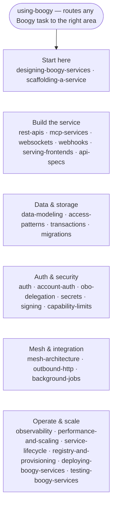

# Boogy Superpowers

Skills that teach coding agents to build [Boogy](https://boogy.ai) services
well. Each skill is a structured markdown file that gives an agent the platform
conventions, safety invariants, and canonical SDK patterns for one topic area —
so instead of guessing, the agent gets it right the first time.

Works with **Claude Code out of the box** (no plugin needed) and with any
agent or tool that can read markdown. Together they help you vibe
production-grade Boogy services: Rust compiled to `wasm32-wasip2`, isolated
transactional per-service storage, capability security, cross-service mesh
calls, and REST/JSON-RPC/MCP surfaces.

---

## Install

### Recommended — vendor into your project

From your project root:

```bash
boogy skills install          # via the boogy CLI
# or, without the CLI:
npx degit Boogy-ai/boogy-superpowers/skills .claude/skills/boogy
```

Claude Code auto-discovers `.claude/skills/`. Re-run `boogy skills update`
(or the same degit command) to refresh.

### Use as a plugin

The repo ships `.claude-plugin/plugin.json` (Claude Code) and
`gemini-extension.json` (Gemini CLI); marketplace listings will follow.

---

## Start here

`skills/using-boogy/SKILL.md` is the entry point — it routes every kind of
Boogy task to the right skill. Open it first before any Boogy work.

---

## Skill map

28 skills, grouped by concern. Every skill appears exactly once.

### Start here

| Skill | Purpose |
|---|---|
| `skills/using-boogy/` | Entry point — routes any Boogy task (services, agent backends, MCP tools, meshes) to the right skill |
| `skills/designing-boogy-services/` | Run before writing any code — questionnaire that produces a design artifact covering routing, data, auth, and capabilities |
| `skills/scaffolding-a-service/` | Turns a design artifact into a buildable project: manifest, Cargo setup, build loop |

### Build the service

| Skill | Purpose |
|---|---|
| `skills/boogy-rest-apis/` | HTTP/REST and JSON-RPC endpoints — routing, guards, request parsing, response types, error wire format |
| `skills/boogy-mcp-services/` | Expose MCP tools, resources, or prompts to LLM clients alongside an existing REST service |
| `skills/boogy-websockets/` | Push real-time messages via named channels — public, private, or per-principal; minting subscription grants |
| `skills/boogy-webhooks/` | Receive and verify inbound webhooks (HMAC-signed callbacks from Stripe, GitHub, Twilio, etc.) |
| `skills/boogy-serving-frontends/` | Serve a web frontend (SPA, admin dashboard, static assets) decoupled from the wasm service |
| `skills/boogy-api-specs/` | Auto-served spec documents (openapi.json, openrpc.json, MCP discovery), visibility control, JsonSchema requirements |

### Data & storage

| Skill | Purpose |
|---|---|
| `skills/boogy-data-modeling/` | Declare tables, design schemas, and choose how to represent data in the typed columnar store |
| `skills/boogy-access-patterns/` | List, lookup, ranking, filter, tag, and pagination queries using the Query DSL and typed model layer |
| `skills/boogy-transactions/` | Atomic multi-row writes, rollback semantics, cross-service transactional calls, and 409 handling |
| `skills/boogy-migrations/` | Change schema of a deployed service — versioned migrations for adding columns, indexes, and backfills |

### Auth & security

| Skill | Purpose |
|---|---|
| `skills/boogy-auth/` | In-service authorization — per-user data, ownership checks, API keys for programmatic callers, scope gating |
| `skills/boogy-account-auth/` | Platform identity layer — login/signup for service users, where principals and tokens come from |
| `skills/boogy-obo-delegation/` | One service acting on a user's behalf when calling another service (on-behalf-of delegation) |
| `skills/boogy-secrets/` | Bind API keys and external credentials so the value never enters service code |
| `skills/boogy-signing/` | Produce cryptographic signatures (receipts, attestations, wallet transactions) without holding the private key |
| `skills/boogy-capability-limits/` | What the platform supports and doesn't — identify gaps and sanctioned alternatives before designing a feature |

### Mesh & integration

| Skill | Purpose |
|---|---|
| `skills/boogy-mesh-architecture/` | Compose multiple services, decide when to split, pass identity and data between services |
| `skills/boogy-outbound-http/` | Call external HTTP APIs or bring-your-own backends — egress allowlist, caps, redirects, credentials |
| `skills/boogy-background-jobs/` | Work outside the request — scheduled tasks, deferred or retried work, fan-out sweeps |

### Operate & scale

| Skill | Purpose |
|---|---|
| `skills/boogy-observability/` | Owner-scoped usage, billing dimensions, request traces, audit tail, quota, and guest logs via REST or MCP |
| `skills/boogy-performance-and-scaling/` | Diagnose 429 / 503 / 504 under load and pick the right lever |
| `skills/boogy-service-lifecycle/` | Retire, deprecate, replace, or remove a deployed service — especially when callers or data are at stake |
| `skills/boogy-registry-and-provisioning/` | Check what already exists in the mesh, publish a module, decide whether to run your own instance |
| `skills/deploying-boogy-services/` | Deploy, update, or remove a service — the authoritative CLI command reference |
| `skills/testing-boogy-services/` | Test a service before claiming it works — build, unit, and live integration layers |

---

## How skills route



---

## License

MIT
