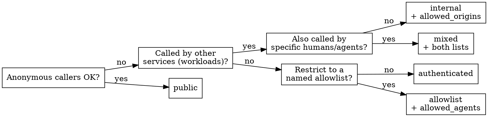

# Designing Boogy services

Boogy's hard choices — who can call you, what you may touch, how data is
keyed — are cheap to get right at design time and expensive to retrofit.
This skill runs a short questionnaire that produces a **design artifact:
decisions, a manifest sketch, and a data sketch. Not handler code.**

## HARD GATE

**No scaffolding and no code until the questionnaire is answered.** Output
the answers first, visibly, then proceed.

"Skip the design / just scaffold" **compresses** the questionnaire to a
six-line summary — it never skips it. Quick is fine; silent is not. A
scaffold built on unstated ingress/capability/data decisions is an
ungoverned scaffold.

## The questionnaire

1. **Service kind** — pick one:

   | Kind | Example | Typical ingress |
   |------|---------|-----------------|
   | User-facing microservice | a notes API behind a UI | `authenticated` |
   | Agent backend | tools/data an LLM client drives | `authenticated` |
   | Internal mesh service | a payment processor other services call | `internal` |
   | Public multi-tenant API | open redirect/link service | `public` |

2. **Surface(s)** — REST · JSON-RPC · MCP · hybrid. One service can serve
   **REST and MCP together** (same data, two surfaces); a split is a
   decision, not a default.

3. **Capabilities** — deny-by-default; list only what you use:
   `store`, `auth`, `clock`, `entropy`, `logging`, `peer` (call other
   services), `outbound_http` (external HTTPS), `background_jobs`,
   `vector`. Each one you grant is attack surface — justify it.

4. **Ingress mode** — answer the flowchart, then the delegation question:

   `allowed_agents` (allowlist/mixed) matches **agents/humans**
   (`*` · `@handle` · `agent_<id>`). `allowed_origins` (internal/mixed)
   matches **workloads** (`boogy://<owner>/services/<name>` · `boogy://<owner>/*`
   · `*`). They are not interchangeable — internal rejects human/anonymous
   callers outright.

   **Delegation:** will another service act on a *user's* behalf when
   calling you? If yes, opt in with `[ingress.delegation]` (`allow_actor`,
   `max_delegated_scopes`); absent that block, on-behalf-of tokens are
   rejected. Authorize on the **principal** (the user), never the actor.

5. **Data sketch** — tables, the owner column (per-row ownership for
   `authenticated` services), and the access patterns you'll need
   (list/lookup/rank/filter). No bare table/column names in real code.

6. **Limits check** — REQUIRED BACKGROUND: `boogy:boogy-capability-limits`.
   Run every feature past the gaps and ceilings (no WebSockets/streaming,
   no large-file storage, request budget, transaction envelope, outbound
   caps) before committing to the design.

## Design output is decisions, not code

The design artifact is the questionnaire answers + a manifest sketch +
the data sketch. **Stop there.** Handler implementation begins at the
scaffolding step, with the SDK reference open, verifying every call
signature. Writing handler bodies at design time is exactly where
fabrication happens.

| Thought | Reality |
|---------|---------|
| "I'll express the design as the full implementation." | Every baseline that did this fabricated SDK signatures (outbound/peer/MCP builder calls, header-templating, middleware that doesn't exist). Decisions first; code after scaffolding. |
| "They said skip design, so design is skipped." | Skip = compress to six lines, never zero. The gate holds under pressure. |
| "I know the right ingress mode without the flowchart." | The modes have non-obvious distinctions (`allowed_agents` vs `allowed_origins`; internal rejects humans; delegation is opt-in). Walk it. |

## Integration

`boogy:using-boogy` routes new-service work here. Next, once the design
artifact exists: `boogy:scaffolding-a-service` (ships in this release).
