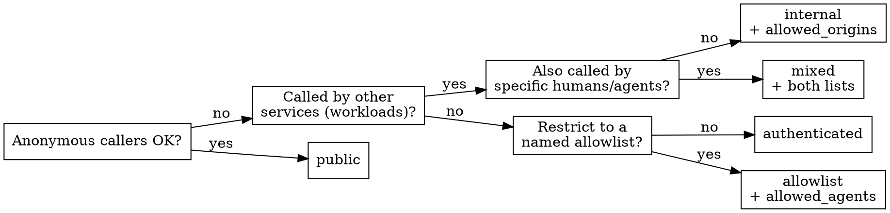

# Designing Boogy services

Boogy's hard choices — who can call you, what you may touch, how data is
keyed — are cheap to get right at design time and expensive to retrofit.
This skill runs a short questionnaire that produces a **design artifact:
decisions, a manifest sketch, and a data sketch. Not handler code.**

## HARD GATE

**No scaffolding and no code until the questionnaire is answered.** Output
the answers first, visibly, then proceed.

"Skip the design / just scaffold" **compresses** the questionnaire to a
six-line summary — it never skips it. Quick is fine; silent is not. A
scaffold built on unstated ingress/capability/data decisions is an
ungoverned scaffold.

## The questionnaire

1. **Shape, then kind** — two picks, **shape first**. Shape decides
   whether you run a backend at all; don't answer "what kind of service"
   before "is this even a service."

   **1a. Deployment shape** — does your code run a backend?

   | What you're building | Shape | What ships |
   |------|------|-----------|
   | A page/site, no backend logic | **Frontend** | `[frontend]`, **no wasm** — host serves static / SPA assets |
   | A UI **and** an API behind it | **FullStack** | `[frontend]` + wasm under `api_prefix` |
   | An API, tools, or mesh service — no UI | **Service** | wasm only (today's default) |

   A **Frontend** deployment runs no wasm: it has **no capabilities, no
   store, no ingress *mode*** (visibility is the `[frontend].private`
   flag, not a mode). If that's you, answer step 7 and **skip steps 4–6
   and 8** — they govern a wasm backend you don't have. See
   `boogy:boogy-serving-frontends`.

   **1b. Backend kind** — skip if **Frontend**; otherwise pick one for the
   wasm:

   | Kind | Example | Typical ingress |
   |------|---------|-----------------|
   | User-facing microservice | a notes API behind a UI | `authenticated` |
   | Agent backend | tools/data an LLM client drives | `authenticated` |
   | Internal mesh service | a payment processor other services call | `internal` |
   | Public multi-tenant API | open redirect/link service | `public` |

2. **Mesh check** — does an existing Boogy service or published module
   already provide this capability (payments, notifications, search,
   ...)? Prefer consuming or provisioning it over a fresh external
   integration — a healthy mesh emerges from services building on each
   other. Not a mandate: when nothing fits, external via `outbound_http`
   is fully sanctioned.

   **2b. Build-vs-buy for complex subsystems** (wasm backends) — when a
   feature needs a genuinely complex or error-prone subsystem the platform
   does **not** hand you as a capability — cryptography, a wire/serialization
   format, a protocol client, a non-trivial parser, financial or
   calendar/timezone math — reach for a **trusted, widely-used, audited
   library** before hand-rolling it. Hand-rolled crypto/encoding/parsing is
   where security holes and subtle correctness bugs live. Two checks before
   you commit to a crate: (a) it's reputable and maintained, and (b) — the
   Boogy-specific one agents forget — it **builds for `wasm32-wasip2`** in the
   feature set you need. Confirm (b) with a quick spike *before* you design
   around it: some crates pull native/C deps or `getrandom` and won't compile
   to the component, and you want to discover that on day one, not after the
   design is committed. If hand-rolling is genuinely the only option, treat it
   as a flagged design risk, not a silent default. (When the platform DOES
   provide the primitive — e.g. `signing` for host-held keys — use it; don't
   pull a crate to re-implement a capability you already have.)

3. **Backend surface(s)** — for a **FullStack** or **Service** shape, what
   API does the wasm expose: REST · JSON-RPC · MCP · hybrid? One service can
   serve **REST and MCP together** (same data, two surfaces); a split is a
   decision, not a default. The frontend itself was decided in **1a** — a
   **FullStack** wasm sits under `[frontend].api_prefix`
   (`boogy:boogy-serving-frontends`); a **Frontend** shape has no backend
   surface, so skip this.

   **Two audiences, not one.** The public/business-logic API is only half the
   surface. Design the **operator/admin surface** as a first-class part of the
   service, not an afterthought: the high-value endpoints whoever *runs* this
   service needs to inspect and intervene **across all principals** — list and
   inspect everything (not just one caller's rows), intervene (revoke, cancel,
   block/unblock an abuser, force a retry or refresh), and read an audit log of
   those operator mutations. Mount them under an owner-gated `/admin/*` subtree
   (only the service owner's identity passes; not regular callers). Sketch
   these now alongside the user-facing routes — a service you can't inspect or
   intervene in across principals is half-built, and retrofitting an operator
   surface onto a data model that didn't plan for cross-principal reads is the
   expensive path.

4. **Capabilities** — deny-by-default; list only what you use:
   `store`, `auth`, `clock`, `entropy`, `logging`, `peer` (call other
   services), `outbound_http` (external HTTPS), `background_jobs`,
   `signing` (produce signatures with a key the host holds and your code
   never touches — see `boogy:boogy-signing`), `websockets` (push
   real-time messages to clients — see `boogy:boogy-websockets`).
   Each one you grant is attack surface — justify it. (Vector/semantic
   search is not yet available — see `boogy:boogy-capability-limits`.)

5. **Ingress mode** — answer the flowchart, then the delegation question:

```dot
digraph ingress {
  rankdir=LR; node [shape=box];
  q1 [label="Anonymous callers OK?"];
  q2 [label="Called by other\nservices (workloads)?"];
  q3 [label="Also called by\nspecific humans/agents?"];
  q4 [label="Restrict to a\nnamed allowlist?"];
  pub  [label="public"];
  auth [label="authenticated"];
  allow[label="allowlist\n+ allowed_agents"];
  intl [label="internal\n+ allowed_origins"];
  mix  [label="mixed\n+ both lists"];
  q1 -> pub  [label="yes"];
  q1 -> q2   [label="no"];
  q2 -> q3   [label="yes"];
  q3 -> mix  [label="yes"];
  q3 -> intl [label="no"];
  q2 -> q4   [label="no"];
  q4 -> allow[label="yes"];
  q4 -> auth [label="no"];
}
```

   `allowed_agents` (allowlist/mixed) matches **agents/humans**
   (`*` · `@handle` · `agent_<id>`). `allowed_origins` (internal/mixed)
   matches **workloads** (`boogy://<owner>/services/<name>` · `boogy://<owner>/*`
   · `*`). They are not interchangeable — internal rejects human/anonymous
   callers outright.

   **Delegation:** will another service act on a *user's* behalf when
   calling you? If yes, opt in with `[ingress.delegation]` (`allow_actor`,
   `max_delegated_scopes`); absent that block, on-behalf-of tokens are
   rejected. Authorize on the **principal** (the user), never the actor.

6. **Data sketch** — the tables, each as a future `#[derive(Model)]`
   struct: its fields, the owner column (per-row ownership for
   `authenticated` services), and the access patterns you'll declare on
   it (`list_by` / `ranked_by` / `lookup_by` / `tagged_by`). The model
   derive is the standard data layer — a hand-written `cols` module or
   `Table::new(...)` is a regression (see `boogy:boogy-data-modeling`).
   Sketch the patterns now so the right indexes are derived later.

7. **Registry metadata** — sketch how a developer would find this module:
   a precise `category` (the thing they file it under — "I need email" →
   `email`, "take payments" → `payments`, NOT a broad bucket like
   "communication"), a few distinct `keywords` (canonical tags, e.g.
   `["email","resend"]` — not phrases that restate the name), and a
   one-line plain-words `description` of what it does for them. Every word
   true and useful; no internal jargon, no aspirational/false terms. The
   full standard + good/bad examples live in
   `boogy:scaffolding-a-service`; decide the gist now so the manifest
   sketch carries it.

8. **Limits check** — REQUIRED BACKGROUND: `boogy:boogy-capability-limits`.
   Run every feature past the gaps and ceilings (no service-authored
   WebSockets/streaming, no large-file storage, request budget,
   transaction envelope, outbound caps) before committing to the design.
   (For viewing your own usage/logs as the owner, see
   `boogy:boogy-observability`.)

## Design output is decisions, not code

The design artifact is the questionnaire answers + a manifest sketch +
the data sketch. **Stop there.** Handler implementation begins at the
scaffolding step, with the SDK reference open, verifying every call
signature. Writing handler bodies at design time is exactly where
fabrication happens.

| Thought | Reality |
|---------|---------|
| "I'll express the design as the full implementation." | Every baseline that did this fabricated SDK signatures (outbound/peer/MCP builder calls, header-templating, middleware that doesn't exist). Decisions first; code after scaffolding. |
| "They said skip design, so design is skipped." | Skip = compress to six lines, never zero. The gate holds under pressure. |
| "I know the right ingress mode without the flowchart." | The modes have non-obvious distinctions (`allowed_agents` vs `allowed_origins`; internal rejects humans; delegation is opt-in). Walk it. |
| "I'll figure out request/response shapes when I write handlers." | Decide the surface now, but know the rule that binds it at implementation: every handler's request body and response is a typed `#[derive(…, schemars::JsonSchema)]` DTO (`Json<T>`/`Created<T>`) — a CI gate FAILS untyped I/O. See `boogy:boogy-rest-apis`. |
| "id + name is enough manifest metadata." | A module with bare `id`+`name` is nearly invisible in the registry — sketch a precise `category`, distinct `keywords`, and a plain-words `description` (see step 7 + `boogy:scaffolding-a-service`). |
| "I'll just hand-roll the crypto / parser / encoding — it's not that hard." | That's where security holes and subtle bugs live. Reach for a trusted, audited library and **confirm it builds for `wasm32-wasip2`** with a quick spike first; hand-rolling is a flagged risk, never a silent default (step 2b). |
| "It compiles into the wasm, so the library's fine." | Not until you've checked. Crates with native/C deps or `getrandom` may not build for `wasm32-wasip2` — spike the compat on day one, before the design depends on it. |
| "The public API is the service; admin can come later." | A service you can't inspect or intervene in across principals is half-built. Design the owner-gated `/admin/*` surface (list-all, revoke/cancel/block, force-retry, audit) alongside the public one — retrofitting cross-principal reads later is the expensive path. |

## Integration

`boogy:using-boogy` routes new-service work here. Next, once the design
artifact exists: `boogy:scaffolding-a-service` (ships in this release).
