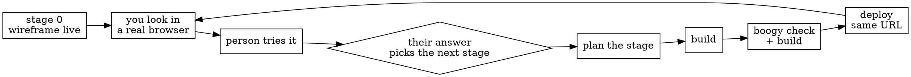

# Shipping in stages

**The person steers by using it.** A new app is live within minutes as a
wireframe of its main screen, then grows one deploy at a time; their answer to
each stage picks the next.



## Stage 0: the main screen, live in minutes

Sign-in comes first (`boogy:boogy-onramp`): nothing deploys without it. Then
ask three questions, each with your recommendation, and nothing else:

1. **Name** — the `service.id`. It is hard to change after deploy.
2. **Shape** — will it have a page? If yes, stage 0 is a **Frontend** whatever
   the final shape: no wasm, no capabilities, no store. If not, stage 0 is a
   router answering its main call with stub JSON; its wasm needs the six-line
   design summary first (`boogy:designing-boogy-services`).
3. **Who can open it**, for stage 0 only: it holds only stub data, so recommend
   "anyone who has the address". Ask again at the first stage that stores real
   data. If they want only themselves now: `[frontend] private = true`,
   `[ingress] mode = "allowlist"`, `allowed_agents = ["@<their handle>"]`; the
   page answers 401 until they sign in at `<URL>/boogy/signin?redirect=/`.

For a page, build the screen they described first, on stub data:

```
boogy.toml
web/index.html
web/main.ts
```

```toml
[service]
id = "pollster"
name = "Pollster"
version = "0.1.0"

[routing]
path = "/"
methods = ["GET"]

[ingress]
mode = "public"

[frontend]
root = "web"
build = "source"

[provisioning]
mode = "private"   # until the person decides whether others may run their own copy
```

```html
<!doctype html>
<html lang="en">
<head>
  <meta charset="utf-8" />
  <meta name="viewport" content="width=device-width, initial-scale=1" />
  <title>Pollster</title>
  <meta name="description" content="Vote on the question on screen." />
  <style>body { margin: 0; padding: var(--space-6); font-family: var(--font-body); }</style>
</head>
<body>
  <div id="app"></div>
  <script type="module" src="./main.js"></script>
</body>
</html>
```

You write `main.ts`; the HTML loads its output, `./main.js`. A page whose only
module script is inline is refused at deploy (`no <script type="module"
src="…"> entry found`). The rest of the SEO baseline
(`boogy:boogy-serving-frontends`) waits for real content.

```ts
import { installFoundation, stack, cardGrid, card, button } from "@boogy/web";

// Stub data, shaped like the API a later stage adds.
const poll = {
  question: "Where should the team offsite be?",
  options: ["Lisbon", "Kyoto", "Mexico City", "Reykjavik"],
};

function el(tag: string, attrs: object = {}, ...kids: (Node | string)[]) {
  const node = document.createElement(tag);
  for (const [k, v] of Object.entries(attrs)) node.setAttribute(k, String(v));
  node.append(...kids);
  return node;
}

installFoundation();
const grid = el("ul", cardGrid());
for (const option of poll.options) {
  const vote = el("button", { ...button({ variant: "solid", fill: true }), type: "button" }, "Vote");
  const title = el("h2", { "data-slot": "title" }, option);
  grid.append(el("li", {}, el("article", card(), title, el("div", { "data-slot": "foot" }, vote))));
}
document.getElementById("app")!.append(el("main", stack({ gap: 4 }), el("h1", {}, poll.question), grid));
```

`@boogy/web` is import-mapped by the platform: no vendoring, no `allow_cdn`.
Its functions return attributes for plain elements; `installFoundation()`
adds their styles and the tokens (`--space-*`, `--font-body`) any page style
of yours is sized from.

```bash
boogy check && boogy deploy boogy.toml --smoke
```

Open the printed `URL:` in a real browser yourself (`Smoke: skipped` is not a
pass), and in a board pane if they will use it there
(`boogy:running-in-a-board`). Then give the person that URL and one question.

## The stage contract

Every later stage, in order (item 3 holds for stage-0 tweaks too):

1. **One thing to try**, in the person's words ("vote from your phone").
2. **Its design answers before its code**: only the questions this stage
   raises (`boogy:designing-boogy-services`).
3. **The same `service.id`**: bump `[service] version` on every redeploy (an
   unbumped one is a 409); the URL stays.
4. **You look first**: the new route and the main one in a real browser, plus
   the authz negatives from the first stage that adds sign-in
   (`boogy:testing-boogy-services`), plus the board checks for an app used in
   a board (`boogy:running-in-a-board`).
5. **They try it**: the URL, what to try, and ONE question about what comes
   next, with your recommendation.
6. **Their answer picks the next stage.** Revise the roadmap
   (`boogy:planning-boogy-work`).

## Order stages by what they want to see

The screen the person would react to most goes first, on stub data; its
backend follows once they accept its shape. Work nobody can see (limits,
hardening) rides inside the stage that needs it.

- **The owner's own data is the home** from the first stage that stores
  anything: their list (polls, retros), never a placeholder home.
- **One visual system:** every screen a later stage adds uses the main
  screen's look. A bold, full-screen style chosen for one screen applies to
  all of them.

## Moving shape in place

Frontend → FullStack is a redeploy of the same `service.id`: add `wasm`,
`[capabilities]` and `[frontend] api_prefix = "/api"`, add every method the
API serves to `[routing] methods` (stage 0 declared only `GET`, so a `POST`
answers 404 until you do), decide `[ingress] mode` again now that the data is
real, and bump the version. The URL stays and `/api/*` reaches the wasm.
Scaffold it (`boogy:scaffolding-a-service`) at the first stage that needs a
backend.

## Data safety across stages

- **Stub data lives in the page**, never in a store real people write to.
  Delete it in the stage that makes that screen real.
- **Columns reconcile on every deploy** (`boogy:boogy-data-modeling`): a new
  table, a new rollup (filled from the rows already stored) and a new field are
  added automatically, except a required reference to another table: make it
  optional. A rename needs `#[renamed_from = "old"]`, a removal needs
  `dropped("col")`. Changing a field's type or nullability, switching a field
  between plain and counter, or adding a counter to a table that already exists
  is refused (`boogy:boogy-migrations`).
- **Get each stored field right when it is first shipped:** its type, whether
  it is optional, and whether it is a counter. A count derived from rows you
  store anyway is a rollup, which a later stage can add; a counter must be
  declared with its table. Add nothing else a later stage might want.

## Ask Tier-1 questions at the stage that needs them

Money, secrets, who can use what, whether others run their own copy: ask each
at the first stage that needs it (`boogy:growing-boogy-meshes`). "Only I
create polls" is settled at the stage that adds creating.

## Worked example: a polling app

"Put a question up full screen with the options in a big grid, people vote from
their phones, I see the results. Only I create polls. Invite with links."

| Stage | Live at the same URL | Question to the person |
|---|---|---|
| 0 | The vote screen: stub question, big grid of options | "Is this your screen? What would you change?" |
| 1 | Real polls: you sign in, your polls are the home, you create one; only you can (FullStack, in place) | "Phones voting next, or results first?" |
| 2 | Invite links: a phone opens one and votes | "One vote per phone: right?" |
| 3 | Results, live: the screen updates as votes land | "Show results to voters too?" |
| 4 | Your dashboard: every poll, close, reopen | "What's missing?" |

## Red flags

| Thought | Reality |
|---|---|
| "A placeholder page counts as stage 0." | "Coming together" or "you're the owner" gives them nothing to react to. Stage 0 is the main screen on stub data. |
| "I'll write the full design and plan first so the stages are right." | The stages are right once the person has steered them. Stage 0 needs three answers; each stage is designed when it is next. |
| "Hand-roll the grid, it's quicker." | `cardGrid()`, `card()`, `stack()` and `button()` are one import away, already mapped. |
| "Stage 0 should be full-stack so I never redeploy." | A wasm build costs the minutes stage 0 saves; FullStack is a redeploy in place. |
| "Owner create first, then voting, then the screen." | That is backend order. Ship the screen they described first. |
| "I'll ask what's next when it's finished." | Every deploy ends with a question; without one it is a demo. |
| "The past-retros list is real only at stage 2." | Their own list is the home from the first stage that stores anything. |
| "The bold style is for the main screen." | Every screen shares it, and each is checked against it. |
